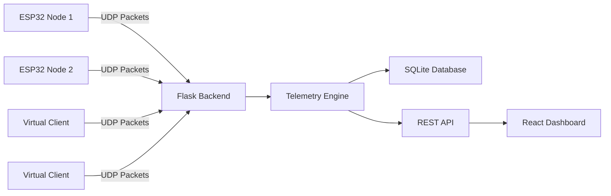
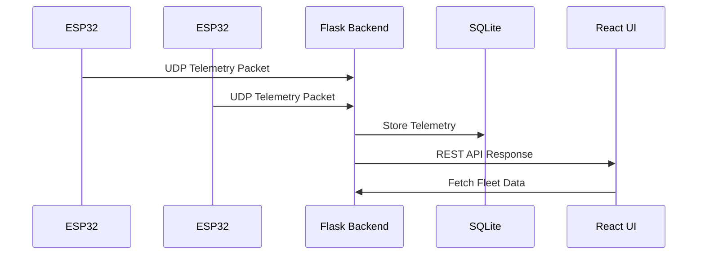

<div align="center">

# 🚀 FleetPulse
### Real-Time Distributed Telemetry Collection and Monitoring Platform

<p>


</p>

### 📡 Distributed Telemetry Collection • ⚡ Real-Time Monitoring • 📊 Fleet Analytics

</div>

---

# 📖 Overview

FleetPulse is a **real-time distributed telemetry platform** designed for collecting, monitoring, and analyzing sensor data from multiple ESP32 and simulated devices.

The system uses **UDP-based communication** to ingest telemetry packets from distributed nodes and provides:

- 📡 Real-time telemetry collection
- 🖥️ Live monitoring dashboard
- 📈 Historical analytics
- ❤️ Device health monitoring
- 📦 Inventory management
- 🚨 Packet loss detection
- 🔄 Multi-client scalability

---

# ✨ Features

## 📡 Distributed Telemetry Collection
- Supports multiple ESP32 and simulated devices.
- UDP-based lightweight communication.
- Sequence tracking for every packet.

## ⚡ Real-Time Monitoring
- Device online/offline detection.
- Heartbeat monitoring.
- Live telemetry updates.

## 📊 Analytics Dashboard
- Fleet statistics.
- Average sensor values.
- Historical graphs.
- Packet loss metrics.

## 💾 Persistence Layer
- SQLite storage.
- Historical telemetry records.
- Device inventory management.

## 🐳 Containerized Deployment
- Docker Compose support.
- One-command startup.

---

# 🏗️ System Architecture



---

# 📦 Project Structure

```text
FleetPulse/
│
├── backend/
│   ├── app.py
│   ├── models/
│   ├── services/
│   ├── database/
│   └── requirements.txt
│
├── frontend/
│   ├── src/
│   ├── components/
│   ├── pages/
│   └── package.json
│
├── simulator/
│   └── virtual_node.c
│
├── docker-compose.yml
└── README.md
```

---

# 🌐 Network Architecture



---

# 📊 Telemetry Packet Format

```text
DeviceID,SequenceNumber,SensorValue
```

Example:

```text
ESP_NODE_01,101,1780
```

---

# 🧠 Packet Loss Detection

```text
Expected Sequence : 15
Received Sequence : 18

Lost Packets = 3
```

---

# ❤️ Device Health Monitoring

```text
If current_time - last_seen > 10 seconds

→ Device Status = OFFLINE
```

---

# 📸 Dashboard

## Fleet Overview

<p align="center">

</p>

## Device Analytics

<p align="center">

</p>

---

# 🚀 Quick Start

## Clone Repository

```bash
git clone https://github.com/yourusername/FleetPulse.git
cd FleetPulse
```

---

# 🐳 Run with Docker

```bash
docker compose up --build
```

---

# Backend

```bash
cd backend
python app.py
```

---

# Frontend

```bash
cd frontend
npm install
npm run dev
```

---

# Simulator

```bash
cd simulator
./simulator
```

---

# 🔥 API Endpoints

| Method | Endpoint | Description |
|--------|-----------|-------------|
| GET | `/api/nodes` | Get all nodes |
| GET | `/api/history/:id` | Get telemetry history |
| DELETE | `/api/nodes/:id` | Remove node |

---

# 📈 Scalability

FleetPulse is designed to support:

✅ Multiple ESP32 devices

✅ Multiple virtual clients

✅ Real-time monitoring

✅ Historical analytics

✅ Distributed telemetry ingestion

---

# 🛠️ Technologies Used

## Embedded
- ESP32
- Arduino Framework

## Backend
- Python
- Flask
- SQLite
- Socket Programming
- UDP
- Multithreading

## Frontend
- React
- Axios
- Recharts

## Deployment
- Docker
- Docker Compose

---

# 🎯 Learning Outcomes

- UDP Networking
- Socket Programming
- Real-Time Systems
- Distributed System Design
- Multi-threaded Backend Development
- Full-Stack Application Development
- IoT Telemetry Collection
- Data Visualization

---

# 🔮 Future Enhancements

- MQTT Support
- Authentication System
- WebSocket Streaming
- Prometheus Metrics
- Kubernetes Deployment
- Alert Engine
- Device Configuration Management

---

# 👨‍💻 Author

**KOTRESH H**

> Building scalable systems one packet at a time 🚀
